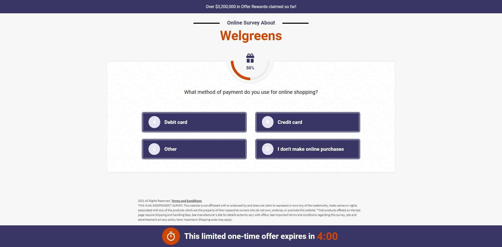

### `Welgreens Survey With Vanilla JS-` [Live Link](https://iftikharrasha.github.io/welgreens-survey-vanilla-js/).

<p align="center">
  <a href="https://iftikharrasha.github.io/welgreens-survey-vanilla-js/">
    
  </a>
</p>

<h1 align="center">Welgreens Survey </h1>

<p align="center">
  Design and prototyping using Adobe XD and built using HTML - SCSS - bootstrap, JS - Jquery. Hosted on github pages!
</p>



## 🚀 Installation

1.  Clone the repository and change directories

    ```shell
    git clone https://github.com/iftikharrasha/welgreens-survey-vanilla-js.git
    cd welgreens-survey-vanilla-js
    ```

2. Click index.html or Start the local server

    The site is now running at `http://127.0.0.1:5500/`!
    

3.  **Open the source code and start editing!**
 
 ## 🎨 Color Reference
| Color          | Hex                                                                |
| -------------- | ------------------------------------------------------------------ |
| White        |  `#FFFFFF` |
| red         |  `#D04500` |
| Green        |  `#4CAF50` |
| Blue       |  `#363563` |
| Primary      |  `#FFB857` |
| Secondary    |  `#F8F8F8` |
| Black        |  `#000000` |
